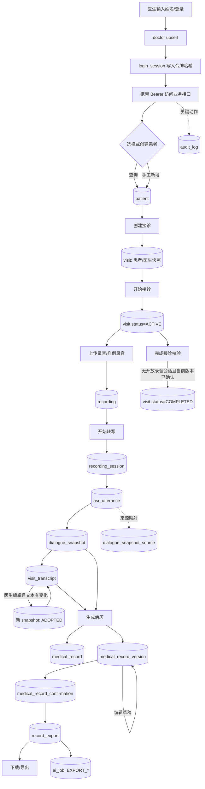
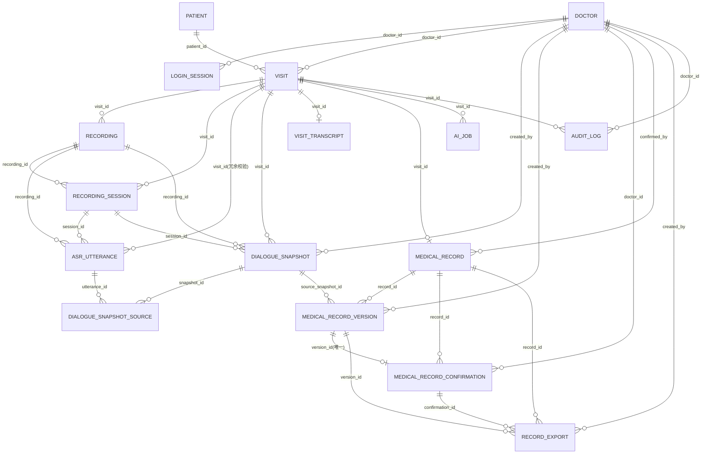

# MedicalAI 数据表关联与业务流程分析

> 分析范围：`backend/src/main/resources/db/migration/schema.sql`、Java Mapper/Service/Controller，以及前端 API 调用。
> 结论反映当前代码实现；“规划中”表示表结构已经预留，但当前代码尚未接入。

## 1. 总体结论

当前数据库围绕一次 `visit`（接诊）组织数据，主链路为：

```text
doctor / login_session
          │
          ├──────────────┐
          ▼              ▼
       patient ───────► visit
                          │
                          ▼
                       recording
                          │
                          ▼
                   recording_session
                          │
                          ▼
                     asr_utterance
                          │
               dialogue_snapshot ◄── dialogue_snapshot_source
                          │
                          ├────────► visit_transcript（当前文本投影/编辑态）
                          ▼
                    medical_record
                          │
                          ▼
                 medical_record_version
                          │
             ┌────────────┴────────────┐
             ▼                         ▼
 medical_record_confirmation       record_export

audit_log 记录上述关键操作；ai_job 当前承载导出异步任务，后续可扩展到 ASR/病历生成。
```

核心实体的粒度：

| 表 | 一行代表什么 | 当前代码状态 |
|---|---|---|
| `doctor` | 一个本地医生身份（由外部系统+外部用户 ID 唯一确定） | 已使用：演示登录、权限归属、确认/审计操作者 |
| `login_session` | 一次登录会话/令牌 | 已使用：令牌哈希认证、续期、注销 |
| `patient` | 患者主数据镜像 | 已使用：查询、手工创建、演示同步 |
| `visit` | 一次医生对患者的接诊 | 已使用：创建、开始、完成、取消及所有权隔离 |
| `recording` | 一段接诊录音的文件元数据 | 已使用：上传、样例录音、状态和对象存储定位 |
| `recording_session` | 一次录音流/ASR 处理会话 | 已建表并写入；当前只在转写时创建后立即 `STOPPED` |
| `asr_utterance` | ASR 输出的一条句段及修订信息 | 已使用：保存规范化句段、回显转写 |
| `dialogue_snapshot` | 某次接诊的不可变对话版本 | 已使用：转写完成后生成，病历以其 hash 作为来源 |
| `dialogue_snapshot_source` | 快照包含哪些 utterance 的多对多桥表 | 转写时写入，编辑新快照时复制；当前无查询接口 |
| `visit_transcript` | 接诊当前展示/编辑的整段文本 | 已使用：GET/PUT 转写；每个接诊仅保留一行 |
| `medical_record` | 一次接诊的病历主对象和当前状态指针 | 已使用：一接诊一病历 |
| `medical_record_version` | 病历的不可变版本及生成/编辑内容 | 已使用：生成、保存草稿、确认前读取 |
| `medical_record_confirmation` | 医生对具体病历版本的确认历史 | 已使用：确认、防重复确认、历史列表 |
| `ai_job` | ASR/病历生成/导出等异步任务、幂等和租约 | 已用于 DOCX/PDF 导出；ASR 和病历生成仍为同步 |
| `record_export` | 绑定确认版本的 DOCX/PDF 导出记录 | 已使用；创建为 `PENDING`，由 Worker 完成状态流转 |
| `audit_log` | 操作审计事件 | 仅写入，当前无查询接口 |

### 1.1 关键字段速查

| 表 | 主键/外键 | 关键字段及作用 |
|---|---|---|
| `doctor` | PK `id` | `external_system+external_user_id` 外部身份唯一；`role/status` 控制角色和可用性 |
| `login_session` | PK `id`；FK `doctor_id` | `access_token_hash` 只存令牌哈希；`expires_at/revoked_at` 控制会话有效期 |
| `patient` | PK `id` | `source_system+source_patient_id` 来源唯一；`phone_masked/id_no_masked` 脱敏展示；`raw_snapshot` 外部原始镜像预留 |
| `visit` | PK `id`；FK `patient_id/doctor_id` | `visit_no` 业务编号；`status` 状态机；`*_snapshot` 保留就诊时身份；`version` 变更计数 |
| `recording` | PK `id`；FK `visit_id` | `object_key` 对象存储定位；`source_type` UPLOAD；`status` 上传/转写状态；`sha256` 完整性预留 |
| `recording_session` | PK `id`；FK `visit_id/recording_id` | `stream_epoch/fencing_token` 防旧流写入；`last_sequence` 断线续传序号；`status` 流会话状态 |
| `asr_utterance` | PK `id`；复合 FK 到 session/recording/visit | `utterance_id+revision+result_type` 修订标识；`role/text/start_ms/end_ms` 句段内容和时间轴 |
| `dialogue_snapshot` | PK `id`；FK visit/recording/session | `snapshot_version` 接诊内版本；`snapshot_hash` 内容指纹；`turns_json` 不可变对话；`authority_status` 是否可作为正式来源 |
| `dialogue_snapshot_source` | PK `(snapshot_id,utterance_id)`；双 FK | 固化快照与原始句段的多对多来源关系 |
| `visit_transcript` | PK/FK `visit_id`；FK `snapshot_id` | 当前整段文本、是否编辑、最后更新时间；属于可变投影 |
| `medical_record` | PK `id`；FK `visit_id` | `current_version` 当前版本指针；`status` DRAFT/CONFIRMED；确认人/时间/版本 |
| `medical_record_version` | PK `id`；FK `record_id/source_snapshot_id` | `version_no` 版本号；`content_json` AI 原文；`edited_content_json` 医生修改；`generation_status` 生成状态 |
| `medical_record_confirmation` | PK `id`；FK record/version/doctor | 一次确认声明及客户端 IP；`version_id` 唯一保证一版本只能确认一次 |
| `ai_job` | PK `id`；FK `visit_id` | `job_type/status` 任务状态；`idempotency_key` 幂等；`attempt_count/locked_at/lease_token` 重试和租约 |
| `record_export` | PK `id`；FK record/version/confirmation/doctor | `format/status/object_key` 导出格式、状态和文件；必须绑定已确认版本 |
| `audit_log` | PK `id`；可选 FK doctor/visit | `action/resource_id/created_at` 记录谁在何时对哪个资源做了什么 |

## 2. 业务流程：每一步去哪些表



### 2.1 当前实现的实际写入顺序

1. **登录**：`DoctorMapper.upsertDemo` 写 `doctor`；`LoginSessionMapper.create` 写 `login_session`。后续请求通过两表 JOIN 认证，并更新 `last_seen_at`。
2. **患者**：`PatientMapper.find/insertManual/upsert` 读写 `patient`。手工患者使用 `source_system=MANUAL`，演示同步使用外部来源唯一键。
3. **创建接诊**：`VisitMapper.create` 写 `visit`，把患者姓名、性别、年龄、电话（掩码）和医生姓名复制到 snapshot 字段，避免主数据后续变化影响历史接诊。
4. **开始/完成/取消**：仅更新 `visit.status`、时间戳和乐观锁 `version`。完成/取消前查询 `recording_session`，阻止存在 `OPEN/STOPPING` 的录音会话。
5. **上传录音**：文件本体由 `AudioStorageService` 保存到本地/对象存储，`RecordingMapper.insert` 只写 `recording` 元数据；上传动作写入 `audit_log`。
6. **转写**：对每个 `UPLOADED` 录音写入 `recording_session`；AI 返回的句段写入 `asr_utterance`（当前实现全部为 `CANONICAL`、`revision=0`）；录音改为 `DONE`；随后合并句段生成一条新的 `dialogue_snapshot`，并写入 `dialogue_snapshot_source`；再将拼接文本 upsert 到 `visit_transcript`。
7. **编辑转写**：文本有变化时创建新的 `dialogue_snapshot`（版本号递增、旧快照置 `SUPERSEDED`），复制来源句段映射，并让 `visit_transcript.snapshot_id` 指向新快照；文本未变化时不产生新版本。
8. **生成病历**：读取最新 `dialogue_snapshot` 和 `visit_transcript`，调用 AI（同步 HTTP）；创建 `medical_record`（若不存在）和一个新的 `medical_record_version`，再把 `medical_record.current_version` 指向该版本并置为 `DRAFT`。
9. **保存/确认**：保存只改 `medical_record_version.edited_content_json`；确认先写 `medical_record_confirmation`，再把 `medical_record` 置为 `CONFIRMED` 并记录确认版本、医生和时间。
10. **导出**：校验当前病历存在且是当前确认版本后写入 `record_export(PENDING)` 和对应 `ai_job(PENDING)`；后台 Worker 生成文件，状态按 `RUNNING → SUCCEEDED/FAILED` 流转。
11. **完成接诊**：`VisitMapper.hasConfirmedCurrentRecord` 通过 `medical_record → medical_record_version → medical_record_confirmation` 判断当前版本已确认，然后更新 `visit`。

## 3. 表之间的关系（ER 图）



### 3.1 关键基数与约束

- `patient 1:N visit`、`doctor 1:N visit`：一个患者可多次就诊，一个医生可有多次接诊；`uq_doctor_active_visit` 限制同一医生同时只能有一个 `ACTIVE` 接诊。
- `visit 1:N recording`：同一次接诊可以追加多段录音，`(visit_id, recording_no)` 唯一。
- `recording 1:N recording_session`：为支持重连/重复处理，设计上允许多个会话；当前代码每次转写只创建一个并立即置 `STOPPED`。
- `recording_session 1:N asr_utterance`：句段必须同时满足 session、recording、visit 的复合外键，防止跨接诊串数据。
- `visit 1:N dialogue_snapshot`：V2 去掉了 V1 中的 `visit_id` 单列唯一约束，改为 `(visit_id, snapshot_version)`，支持追加录音和重新采用。
- `dialogue_snapshot N:M asr_utterance`：通过 `dialogue_snapshot_source` 固化快照来源句段。
- `visit 1:1 visit_transcript`：当前文本只有一份，编辑会覆盖该投影记录。
- `visit 1:1 medical_record`、`medical_record 1:N medical_record_version`：病历主对象只有一个，版本可累积；`current_version` 通过复合外键保证指向本病历的真实版本。
- `medical_record_version 0..1 confirmation`：`uq_confirmation_version` 保证同一版本最多确认一次；确认历史仍可跨版本累积。
- `record_export` 必须同时绑定 `record_id + version_id + confirmation_id`，保证导出的是已确认版本。

## 4. 冗余、未使用和风险分析

### 4.1 明确存在的结构性冗余（建议处理）

| 对象 | 判断 | 原因/建议 |
|---|---|---|
| `visit.current_record_id` | 已删除 | 当前病历通过 `medical_record.visit_id`（唯一）和 `medical_record.current_version` 定位，统一脚本会兼容删除旧数据库中的该列。
| `medical_record_version.source_snapshot_hash` | 有意冗余，可保留 | `source_snapshot_id` 已能定位快照，但 hash 用于内容完整性/跨服务幂等校验；应增加校验逻辑，避免两者不一致。
| `visit_transcript` 与 `dialogue_snapshot.turns_json` | 功能重叠但不是简单重复 | snapshot 是不可变审计来源，transcript 是当前可编辑文本投影。建议保留，但明确命名/注释为 projection，并增加 transcript 版本表或把编辑结果写成新 snapshot。
| `visit` 中患者/医生 snapshot 字段 | 有意冗余，应保留 | 用于历史一致性；不要改成实时 JOIN 主数据。

### 4.2 当前代码未真正使用（不是立即删除，应先补齐或降级）

| 表/字段 | 证据 | 建议 |
|---|---|---|
| `ai_job` | 已用于导出异步任务；ASR/病历生成仍未接入 | 导出 Worker 使用 `EXPORT_DOCX/EXPORT_PDF`；后续可继续扩展 ASR 和病历生成任务。
| `recording_session` 的流控字段 | 当前只写 `recording_fencing_token`、`status=STOPPED`；`stream_epoch/last_sequence/last_event_id/reconnect_count` 未维护 | 一期整段上传模式下可简化为处理批次表；若保留，应实现 OPEN→STOPPING→STOPPED/FAILED 状态机和重连更新。
| `dialogue_snapshot_source` | 写入并在编辑快照时复制 | 当前病历主要依赖 `turns_json`，桥表用于追溯来源；后续可增加按句段重建与一致性校验。
| `audit_log` | 只 INSERT，没有查询/导出接口 | 不是无用表，但目前不可运营。建议增加按 visit/doctor/time 查询，并给 `action` 建枚举/字典约束；`resource_id` 可考虑拆成类型+ID。
| `record_export.markSucceeded` | 由 `ExportJobWorker` 调用 | Worker 仅在真实文件写入成功后写入 `object_key` 并置 `SUCCEEDED`；异常按重试策略回到 `PENDING` 或置 `FAILED`。
| `patient.phone_ciphertext`、`id_no_hash` | 迁移定义，业务代码不写不读 | 若不需要解密/去重，删除；若需要，补充加密密钥管理、写入和访问审计。当前实际只使用 `phone_masked`、`id_no_masked`。
| `patient.raw_snapshot` | 仅依赖数据库默认 `{}`，查询层不使用 | 外部同步审计需要它就保存原始快照并做脱敏；否则删除以减少敏感数据存储。
| `doctor.employee_no`、`doctor.metadata` | 当前 Mapper/VO 未使用 | 外部身份映射需要则补充字段同步；否则可后置，不影响核心链路。
| `recording.sha256` | 插入时没有计算/写入 | 重复文件检测和完整性校验暂未实现；建议上传时计算并建立 `(visit_id, sha256)` 索引/幂等策略。
| `ai_job.result_ref` | 无外键、无读取 | 目前语义不明确；建议改为明确的结果表外键，或使用 `result_json/result_type` 并配合任务类型约束。

### 4.3 实现层面的重要不一致

1. **异步设计未落地**：文档要求 `ai_job`、202 响应、重试和恢复，但当前 `ClinicalWorkflowService.transcribe/generate` 是同步调用 AI；长音频会阻塞请求，重复点击也没有任务幂等保护。
2. **导出状态已改为异步**：创建时为 `PENDING`，Worker 领取后为 `RUNNING`，只有真实文件生成成功才为 `SUCCEEDED`，失败为 `FAILED`。
3. **转写编辑产生新版本**：文本变化会创建新的 `dialogue_snapshot(ADOPTED)`，旧快照置 `SUPERSEDED`；病历生成与确认均校验 `visit_transcript.snapshot_id`、病历来源快照和最新 `ADOPTED` 快照一致，否则返回 `SOURCE_CHANGED`。
4. **`visit.current_record_id` 已移除**：不再存在未维护的冗余当前病历指针。
5. **录音会话时间状态不一致**：`RecordingMapper.createSession` 插入时直接写 `status='STOPPED'`，但没有写 `stopped_at`；如果后续依赖时间计算或恢复任务，会得到不完整状态。
6. **审计覆盖不完整**：已有上传、转写、生成、编辑、确认、导出等事件，但登录、患者创建、接诊状态变化、下载等动作未统一写入，和文档审计事件清单不完全一致。
7. **状态约束不完整**：`recording.status`、`recording.source_type`、`ai_job.job_type/status` 没有 CHECK 约束，容易出现拼写或非法状态；建议补充枚举约束。

## 5. 建议的收敛方案（按优先级）

### P0：先保证数据正确性

- `visit.current_record_id` 已删除，当前病历统一通过 `medical_record.visit_id/current_version` 定位。
- 导出已绑定当前确认版本，异步完成前保持 `PENDING/RUNNING`，禁止伪造 `SUCCEEDED`。
- ASR/病历生成接入 `ai_job`，以 `idempotency_key + visit/recording/snapshot` 防重复，并记录失败原因、重试次数和租约。
- 将转写编辑变成新 snapshot（或新增 transcript_version 表），确认/生成只接受最新 `ADOPTED` snapshot。

### P1：补齐可运维性和审计

- 增加审计查询接口和下载事件；统一 action 枚举。
- 使用 `dialogue_snapshot_source` 重建快照内容并做一致性校验。
- 计算 `recording.sha256`，实现重复上传检测。
- 完善 recording_session 状态机；如果明确不做实时流，可将流控字段和表降级为简化的“转写批次”模型。

### P2：清理或隔离非核心字段

- 对 `phone_ciphertext/id_no_hash/raw_snapshot` 做数据分级：不用则删除，需要则落实加密、密钥轮换、访问审计和保留期限。
- 对 `doctor.employee_no/metadata`、`ai_job.result_ref` 明确 owner 和消费方；长期无消费再删除。

## 6. 参考代码位置

- 建表、约束、字段变更与中文备注：`../backend/src/main/resources/db/migration/schema.sql`
- 患者/接诊：`backend/src/main/java/com/medicalai/mapper/PatientMapper.java`、`VisitMapper.java`、`service/PatientService.java`、`VisitService.java`
- 录音/ASR/快照/转写：`backend/src/main/java/com/medicalai/mapper/RecordingMapper.java`、`service/ClinicalWorkflowService.java`
- 病历/确认/导出/审计：`backend/src/main/java/com/medicalai/mapper/MedicalRecordMapper.java`、`service/ClinicalWorkflowService.java`
- 前端调用链：`frontend/src/api.ts`、`frontend/src/components/ClinicalWorkbench.vue`
- 目标异步闭环：`docs/业务流程闭环优化计划.md`
